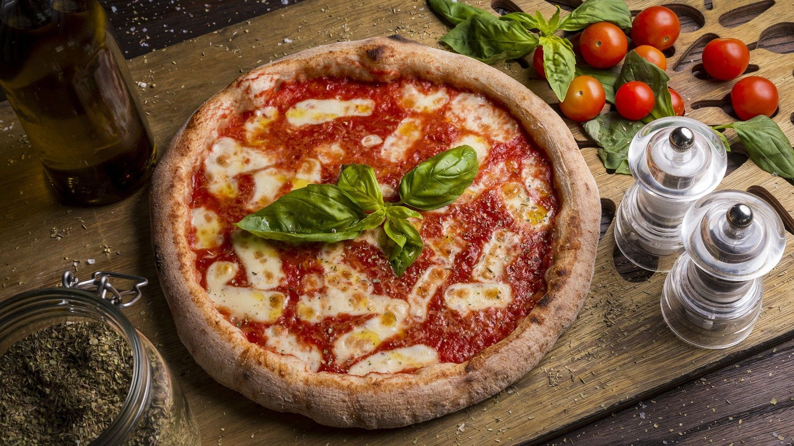

# Pizza Recipe

## BENODIGDHEDEN

- **Pizzadeeg** - 1 bol (250g)
- **Tomatensaus** - 100ml
- **Mozzarella** - 125g
- **Parmezaanse kaas** - 30g
- **Basilicum** - Een paar blaadjes
- **Olijfolie** - 1 eetlepel
- **Zout** - Naar smaak
- **Peper** - Naar smaak

## BEREIDING

1. **Voorverwarmen**: Verwarm de oven voor op 250°C.
2. **Pizzadeeg uitrollen**: Rol het pizzadeeg uit op een bakplaat of pizzasteen.
3. **Tomatensaus toevoegen**: Verdeel de tomatensaus gelijkmatig over het deeg.
4. **Mozzarella toevoegen**: Snijd de mozzarella in dunne plakken en verdeel ze over de pizza.
5. **Kaas en kruiden**: Strooi Parmezaanse kaas, zout en peper over de pizza.
6. **Afwerken met olijfolie**: Druppel een beetje olijfolie over de pizza.
7. **Bakken**: Bak de pizza in de oven gedurende 10-12 minuten, tot de korst goudbruin is.
8. **Basilicum toevoegen**: Voeg verse basilicumblaadjes toe zodra de pizza uit de oven komt.
9. **Serveren**: Snijd de pizza en geniet!
